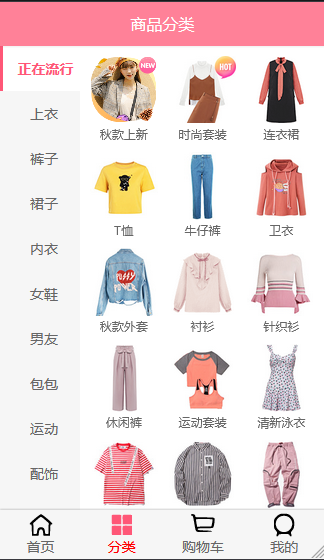
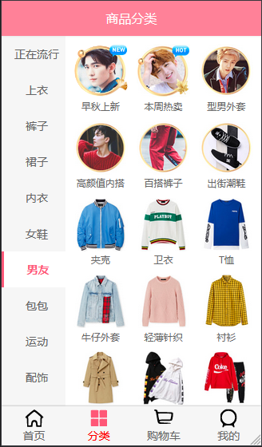
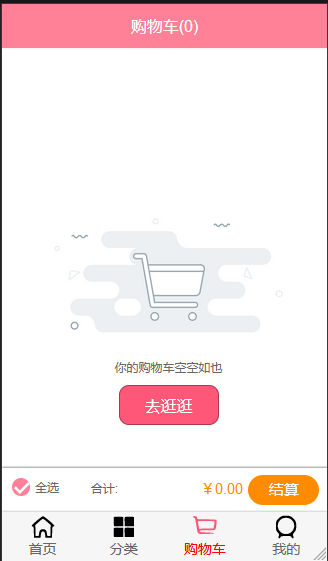
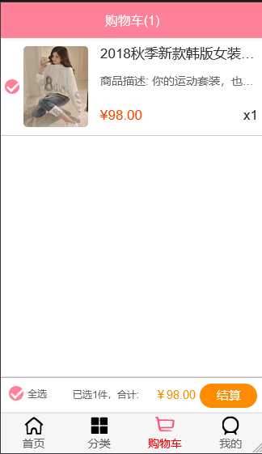
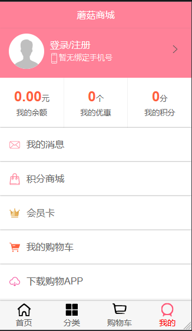
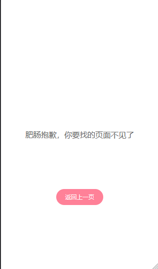

# vuemall
接口涉及隐私，此项目中的接口只能获取部分首页数据，将接口地址更换为coderwhy老师的接口便可正常运行
## Project setup
```
npm install
```
### Compiles and hot-reloads for development
```
npm run serve
```
### Compiles and minifies for production
```
npm run build
```
### 一、首页

#### 首页商品栏


1. 轮播图自动轮播图片，可左滑右滑
2. 三个商品栏互相切换时，互不干扰，可以记住切换前的位置，刷到底部自动请求数据（详情请看 **演示** 文件夹的视频1）
3. 从主页切换到其他页面时，记住当前浏览位置，返回主页时恢复（详情请看 **演示** 文件夹的视频2）
4. 点开主页的商品卡片，跳转到商品详情页


   
顶部导航栏根据当前浏览位置自动将对应标签的颜色变为红色，点击标签可跳转到对应位置（详情请看 **演示** 文件夹的视频3）

### 二、分类页




点击商品卡片可跳转至商品详情页

### 三、购物车
没有将商品添加到购物车时，点击去逛逛可跳转至主页



商品详情页点击加入到购物车时，出现“添加成功，在购物车等亲~”，三秒后消失




### 四、个人页


### 五、错误页
当输入的url错误或点击的商品不存在时，自动跳转到此页


